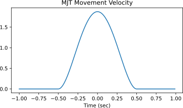
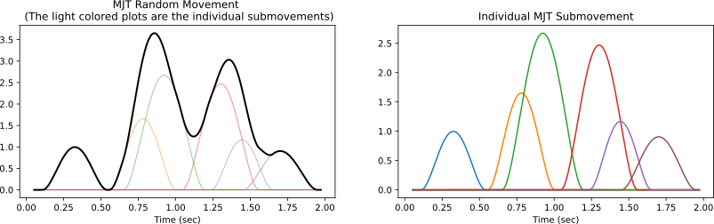

# Movements

This module contains functions for generating simulated movements. Two types of movement profiles are implemented: (a) minimum jerk profile, and (b) Gaussian movement profiles.

The detailed documentation of the `movements` module can be found [here](movementsdoc).

## Minimum Jerk Trajectory (MJT)
The MJT is the movement profile for a discrete movement from point A to point B, executed in {math}`T` seconds, which has the minimum squared jerk computed over the duration of the movement[^flash1985]. The expression for the velocity of the minimum jerk profile implemented in the `movements` module is given by,
```{math}
    v(t) = v_{0} \left[30 \left(\frac{t - t_0}{T}\right)^2 - 60 \left(\frac{t - t_0}{T}\right)^3 + 30 \left(\frac{t - t_0}{T}\right)^4\right], \quad t \in [t_0, t_0 + T]
```
where {math}`v_{0}` is the peak velocity, and {math}`t_0` is the time at which the movement begins.

The `movements` module can be used to generate a MJT movement profile using the function `mjt_discrete_movement`. This function generates an MJT profile that is centred around the origin by default. The function returns the velocity profile by default.

```{code} python
>>> import numpy as np
>>> from monalysa import movements
>>> t = np.arange(-1, 1, 0.01)
>>> move = movements.mjt_discrete_movement(time=t)
>>> # Plot the generated Gaussian movement.
>>> fig = plt.figure(figsize=(6, 3))
>>> plt.plot(t, move)
>>> plt.title("MJT Movement Velocity");
```


## Gaussian Profile
The Gaussian trajectory profile is also often used as a reasonable approximation of a healthy movement profile for discrete movements. The Gaussian velocity profile implemented in the `movements` module is given by,
```{math}
    v(t) = v_0\exp\left[-\left(5\frac{t - t_0}{T}\right)^2\right], \quad t \in [t_0, t_0 + T]
```
where {math}`v_{0}` is the peak velocity, and {math}`t_0` is the time at which the movement begins.

```{code} python
>>> import numpy as np
>>> from monalysa import movements
>>> t = np.arange(-1, 1, 0.01)
>>> move = movements.gaussian_discrete_movement(time=t)
>>> # Plot the generated Gaussian movement.
>>> fig = plt.figure(figsize=(6, 3))
>>> plt.plot(t, move)
>>> plt.title("Gaussian Movement Velocity");
```


The module also supports the generation of more complex velocity profiles using the MJT or the Gaussian profile as a submovement. The following code snippet shows how to generate a random velocity profile using the MJT as a submovement.

```{code} python
>>> time, move, submove = movements.generate_random_movement(move_type='mjt')
>>> fig = plt.figure(figsize=(14, 3.5))
>>> ax = fig.add_subplot(121)
>>> ax.plot(time, submove.T, lw=1, alpha=0.5)
>>> ax.plot(time, move, color="k", lw=2)
>>> ax.set_xlabel("Time (sec)")
>>> ax.set_title("MJT Random Movement \n (The light colored plots are the individual submovements)");
>>> ax = fig.add_subplot(122)
>>> ax.plot(time, submove.T)
>>> ax.set_xlabel("Time (sec)")
>>> ax.set_title("Individual MJT Submovement");
```


**References**
[^flash1985]: Flash, Tamar, and Neville Hogan. "The coordination of arm movements: an experimentally confirmed mathematical model." The Journal of Neuroscience 5.7 (1985): 1688-1703.
