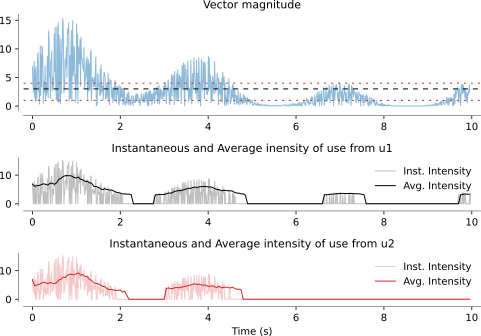
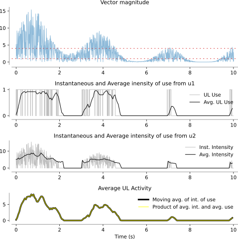

# UL Intensity of Use

UL use only tells us if a functional movement is being performed or not at a given instant. It contains no information about how intensely, how fast, how strongly a functional movement is being performed. This is captured by the UL intensity of use measures[^david2021b].

The detailed module documentation for `ulint` can be found [here](ulintdoc).

## Intensity of Use

> **Definition.** **Instantaneous Intensity of Use** is a construct that reflects how strenuous a movement/posture is at a particular instant of time, when the upper-limb is in use.

The magnitude of movement velocity, acceleration, interaction force, muscle activity, etc. are potential measures of instantaneous intensity of use. The instantaneous intensity of use is a non-negative signal, which is 0, when UL use is 0 (by definition).

The following code snippet shows how to compute the instantaneous intensity of use from th vector magntidue signal.

```{code} python
>>> import numpy as np
>>> from monalysa.ulfunc import uluse
>>> from monalysa.ulfunc import ulint
>>> fs = 100
>>> t = np.arange(0, 10, 1. / fs)
>>> vmag = np.square(np.sin(2 * t) + np.cos(0.4 * t) + 2) * np.random.rand(len(t))
>>> th1, th2l, th2h = 3, 1, 4
>>> _, u1 = uluse.from_vec_mag(vmag, thresh=th1)
>>> _, u2 = uluse.from_vec_mag_dblth(vmag, thresh_l=th2l, thresh_h=th2h)
>>> _, i1 = ulint.from_vec_mag(vmag, u1, 1)
>>> _, i2 = ulint.from_vec_mag(vmag, u2, 1)
>>> _inx1, avgi1 = ulint.average_intuse(i1, u1, windur=0.25, winshift=0.05, fs=fs)
>>> _inx2, avgi2 = ulint.average_intuse(i2, u2, windur=0.25, winshift=0.05, fs=fs)
```
Plotting the different intensity of use related variables from the above code snippet, we get the following figure. UL use is detected using two approaches, and both are used to compute the intantaneius intensity of use and average intensity of use. The average intensity of use is computed over a window 0.25sec long shifting every 50ms using `average_intuse`.



The top row displays the vector magnitude signal in light blue along with the thresholds used to detect UL use from the two functions `uluse.from_vec_mag` and `uluse.from_vec_mag_dblth`. The instantaneous and average UL intensity of use are shown in the second and third rows; the light plot is the instantaneous intensity of use, and the darker trace is the average intensity of use.

## Average UL Activity
UL use and intensity of use can be used to answer the question about how active an UL is, which include both how long adn how intensely an UL i used[^david2021b]. This is the average UL activity construct.

> **Definition.** **Average Upper Limb Activity** is a construct that reflects of how long and how intensely an upper-limb is used in a given time period {math}`D`.

The function `average_ulactivity` can be used for computing the average upper limb activity, as demonstrated by the following code snippet.

```{code} python
>>> import numpy as np
>>> from monalysa.ulfunc import uluse
>>> from monalysa.ulfunc import ulint
>>> from monalysa.ulfunc import measures
>>> fs = 100
>>> t = np.arange(0, 10, 1. / fs)
>>> vmag = np.square(np.sin(2 * t) + np.cos(0.4 * t) + 2) * np.random.rand(len(t))
>>> th2l, th2h = 1, 4
>>> _, _use = uluse.from_vec_mag_dblth(vmag, thresh_l=th2l, thresh_h=th2h)
>>> _, _int = ulint.from_vec_mag(vmag, _use, 1)
>>> _inxu, _avgu = uluse.average_uluse(_use, windur=0.25, winshift=0.05, fs=fs)
>>> _inxi, _avgi = ulint.average_intuse(_int, _use, windur=0.25, winshift=0.05, fs=fs)
>>> _inxa, _avga = measures.average_ulactivity(_int, windur=0.25, winshift=0.05, fs=fs)
```
Plotting the different variables from the above code snippet, we get the following figure. UL use is computed using `uluse.from_vec_mag_dblth` and instantaneous intensity of use from `uluse.from_vec_mag`. The average constructs are computed over a window 0.25sec long shifting every 50ms using `uluse.average_uluse` and `ulint.average_intuse`. The average UL activity is computed using `ulint.average_ulactivity`.



The plot in the last row displays the average UL activity computed using `ulint.average_ulactivity` (in black) and as the product of average UL use and average intensity of use (in yellow); both are exactly the same.

```{code} python
>>> np.all(np.round((_avgu * _avgi) - _avga, 10) == 0)
True
```
Due to numerical precision, the two signals are not exactly the same, but they are very close upto to at least 10 decimal places.

**References**
[^david2021b]: David, Ann, Tanya Subash, S. K. M. Varadhan, Alejandro Melendez-Calderon, and Sivakumar Balasubramanian. "A framework for sensor-based assessment of upper-limb functioning in hemiparesis." Frontiers in Human Neuroscience 15 (2021).