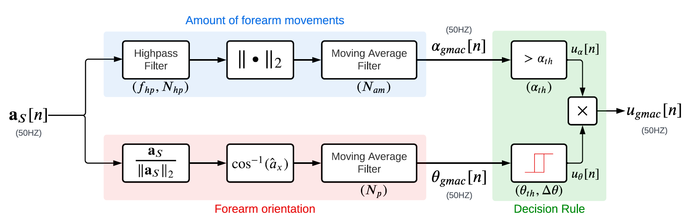

# Upper Limb Use


Upper limb use assessment focuses only on measuring willed movements or postures of functional significance. Identifying such movements is a relatively trivial task for a human observing a subject performing various movements. A human’s ability to relate  to the movements being observed allows him/her to make judgements about the nature of a subject’s movements.

Upper limb use is the fundamental construct of upper limb functioning 
[^david2021b]. It is essential for deriving the other constructs in upper limb functioning.

> **Definition.** **Upper Limb Use** a binary construct indicating the presence or absence of a voluntary, 
meaningful movement or posture

## Measures of Upper Limb Use
The most popular sensing modality is inertial sensing using inertial measurement units (IMUs) in the form of wristbands, which measure linear acceleration and angular velocities of the forearm. Various measures have been developed to quantify
upper limb use from only wrist-worn IMU data.

### Thresholded Activity Counts (AC)
The amount of acceleration is thresholded using a measure specific threshold to estimate upper limb use. The computational simplicity of this measure makes it a quick and popular approach [^bailey2014] [^delucena2017]. However, while an increased amount of acceleration most likely correlates with increased upper-limb use, the feature is not unique to functional movements, and thus overestimates upper limb use. Two types of TAC measures were evaluated in this study: activity counting [^delucena2017], and vector magnitude [^bailey2014].


### GMAC

**Gross Movement (GM) Score**. GM measure [^leuen2017] uses yaw and pitch angles computed using the Madgwick algorithm from the raw acceleration and gyroscope data. If the overall absolute change in yaw and pitch angles is higher than 30° and the absolute pitch of the forearm is within ± 30° in a time window, GM is defined as 1 (indicating functional use), else it is 0. The GM measure exploits the nature of most functional movements to occur in this ‘functional space’, i.e., in the region in front of subject around his/her chest height.

The AC measures are known to be highly sensitive while having very low specificity, and GM is highly specific but not sensitive [^subash2022]. The hybrid measure — GMAC combines the essential elements of TAC and GM measures. It employs counts with a modified GM measure; the counts are used instead of the absolute change in yaw and pitch angles. The ```from_gmac``` function in the ```uluse``` module uses an optimized version of the algorithm with a hysteresis threshold on the pitch angles [^gmac].



```{code} python
>>> import numpy as np
>>> from monalysa.ulfunc import uluse
>>> fs = 50 # sampling frequency
>>> T = 60 # total number of seconds
>>> t = np.arange(0, T, 1/fs)
>>> ax = 0.5*np.sin(0.2 * 2*np.pi*t)
>>> ay = 0.1*np.sin(0.05 * 2*np.pi*t)
>>> az = 0.8*np.sin(0.02 * 2*np.pi*t)
>>> accl = np.array([ax, ay, az]).T
>>> accl_farm_inx = 0 # index of column with acceleration along the forearm 
>>> elb_to_farm = True # axis points from elbow to forearm
>>> pitch, amag, use = uluse.from_gmac(accl, fs, accl_farm_inx, elb_to_farm)
>>> pitch
array([         nan,  80.48298345,  80.48104485, ..., -13.55580179,
       -12.70897362, -11.85026972])
>>> amag
array([0.00000000e+00, 5.05107719e-05, 1.50603641e-04, ...,
       3.11586714e-01, 3.11590258e-01, 3.11593662e-01])
>>> use
array([0., 0., 0., ..., 0., 0., 0.])
```
**References**
[^david2021b]: David, Ann, Tanya Subash, S. K. M. Varadhan, Alejandro Melendez-Calderon, and Sivakumar Balasubramanian. "A framework for sensor-based assessment of upper-limb functioning in hemiparesis." Frontiers in Human Neuroscience 15 (2021).
[^bailey2014]: Bailey, Ryan R., Joseph W. Klaesner, and Catherine E. Lang. "An accelerometry-based methodology for assessment of real-world bilateral upper extremity activity." PloS one 9, no. 7 (2014).
[^delucena2017]: de Lucena, Diogo S., Oliver Stoller, Justin B. Rowe, Vicky Chan, and David J. Reinkensmeyer. "Wearable sensing for rehabilitation after stroke: Bimanual jerk asymmetry encodes unique information about the variability of upper extremity recovery." In 2017 International Conference on Rehabilitation Robotics (ICORR), pp. 1603-1608. IEEE, 2017.
[^leuen2017]: Leuenberger, Kaspar, Roman Gonzenbach, Susanne Wachter, Andreas Luft, and Roger Gassert. "A method to qualitatively assess arm use in stroke survivors in the home environment." Medical & biological engineering & computing 55 (2017): 141-150.
[^subash2022]: Subash, Tanya, Ann David, StephenSukumaran ReetaJanetSurekha, Sankaralingam Gayathri, Selvaraj Samuelkamaleshkumar, Henry Prakash Magimairaj, Nebojsa Malesevic et al. "Comparing algorithms for assessing upper limb use with inertial measurement units." Frontiers in Physiology 13 (2022): 2611.
[^gmac]: Balasubramanian, Sivakumar. "GMAC: A simple measure to quantify upper limb use from wrist-worn accelerometers." medRxiv (2023): 2023-11.
